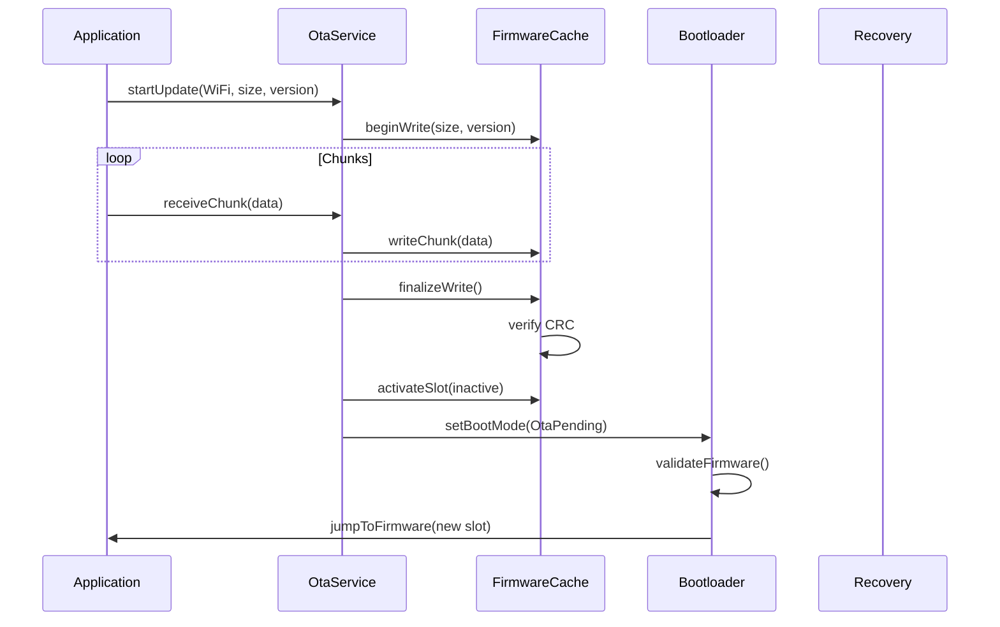
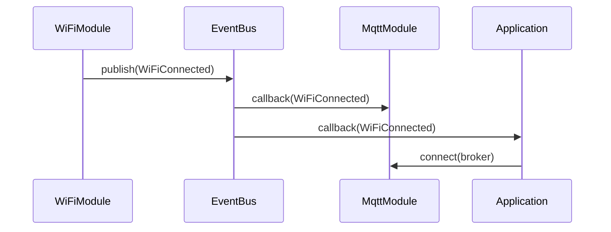
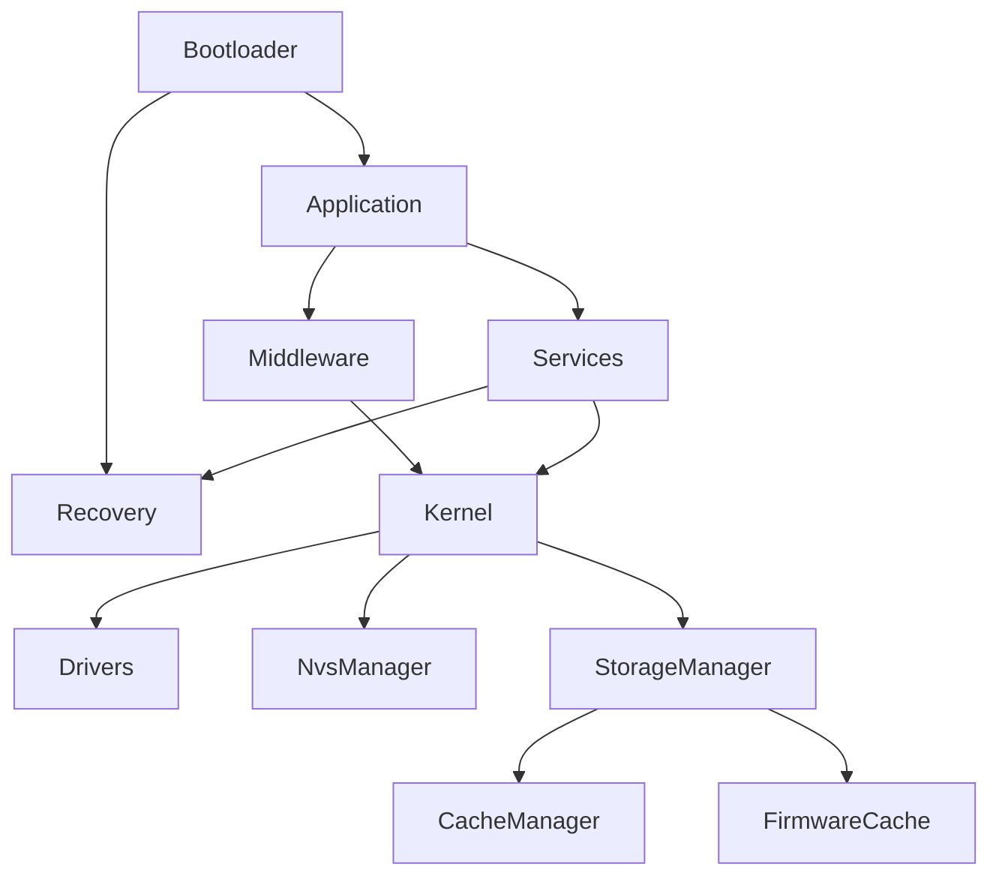

# TAKT OS Architecture

## 1. Overview

TAKT OS is a real-time operating system for ESP32 built around the concept of the **takt** (German: Takt — beat, cycle). Unlike FreeRTOS and similar systems, where scheduling is based on task priorities, TAKT OS uses a **deterministic cyclic dispatcher**: on every takt the kernel sequentially invokes all registered modules.

### Key principles

1. **Determinism** — every module receives control in a fixed order on every takt
2. **Predictability** — static modules perform a strictly bounded amount of work
3. **Modularity** — all subsystems are implemented as modules with a unified `IModule` interface
4. **Fault tolerance** — independent bootloader and recovery layer
5. **Industrial readiness** — profiling, diagnostics, OTA with rollback

## 2. Architecture layers

```
┌─────────────────────────────────────────────────────────┐
│                   Application Layer                      │
│  UART │ Modbus │ MQTT │ BLE │ WiFi │ WebServer │ Demo  │
├─────────────────────────────────────────────────────────┤
│                   Middleware Layer                       │
│  Modules (Static / Dynamic / Background)                 │
├─────────────────────────────────────────────────────────┤
│                   Services Layer                         │
│  OTA Service │ Telemetry │ Config Manager               │
├─────────────────────────────────────────────────────────┤
│                   Kernel Layer                           │
│  Scheduler │ EventBus │ TimerManager │ Diagnostics      │
│  StorageManager │ CacheManager │ FirmwareCache │ NVS    │
├─────────────────────────────────────────────────────────┤
│                   Drivers Layer                          │
│  GPIO │ UART │ ADC │ SPI │ I2C │ Platform               │
├─────────────────────────────────────────────────────────┤
│                   Recovery Layer                         │
│  BLE DFU │ WiFi OTA │ Rollback │ Firmware Install       │
├─────────────────────────────────────────────────────────┤
│                   Bootloader                             │
│  Boot Mode │ Validation │ Emergency │ Partition Jump     │
├─────────────────────────────────────────────────────────┤
│                   Hardware (ESP32)                       │
└─────────────────────────────────────────────────────────┘
```

## 3. Takt concept

```
  Takt N                          Takt N+1
  ┌──────────────────────────┐   ┌──────────────────────────┐
  │ Timer Tick               │   │ Timer Tick               │
  │ Event Dispatch           │   │ Event Dispatch           │
  │ ┌──────┐ ┌──────┐       │   │ ┌──────┐ ┌──────┐       │
  │ │ UART │→│Sensor│→ ...  │   │ │ UART │→│Sensor│→ ...  │
  │ └──────┘ └──────┘       │   │ └──────┘ └──────┘       │
  │ ┌──────┐ ┌──────┐       │   │ ┌──────┐                │
  │ │ WiFi │ │ MQTT │       │   │ │ WiFi │  (bg, idle)    │
  │ └──────┘ └──────┘       │   │ └──────┘                │
  │ Statistics / Overrun     │   │ Statistics / Overrun     │
  └──────────────────────────┘   └──────────────────────────┘
```

### Module types

| Type | Behavior in a takt | Time control |
|------|--------------------|--------------|
| Static | Always invoked, fixed workload | `budgetUs()` — microsecond limit |
| Dynamic | Always invoked, workload defined by the module | No hard limit |
| Background | Invoked only when `hasWork() == true` | Skipped when idle |

## 4. Flash memory map

Layout matches `examples/demo_controller/partitions.csv`:

```
Offset      Size       Partition
0x001000    28 KB      Bootloader (ESP-IDF 2nd stage)
0x008000     4 KB      Partition Table
0x009000    24 KB      NVS
0x00F000     4 KB      PHY Init
0x010000  1024 KB      Factory App
0x110000   256 KB      Recovery Firmware
0x150000  1280 KB      App Slot A (OTA_0)
0x290000  1280 KB      App Slot B (OTA_1)
0x3D0000   192 KB      Raw Storage
```

## 5. Data flows

### OTA update flow



### Event bus flow



## 6. Component dependencies



## 7. Comparison with classic RTOS

| Aspect | FreeRTOS | TAKT OS |
|--------|----------|---------|
| Scheduling | Priorities + preemptive | Cyclic takt |
| Determinism | Depends on priorities | Order guaranteed |
| Overhead | Context switch ~1–5 µs | Direct call, 0 switches |
| Complexity | High (deadlock, priority inversion) | Low (linear loop) |
| Parallelism | Multitasking | Cooperative within a takt |
| Best suited for | General purpose | Industrial controllers, IoT gateways |

## 8. Target devices

- **Reference demo** — example industrial controller
- **IoT gateways** — Modbus/MQTT telemetry aggregation
- **Industrial controllers** — equipment control
- **Telemetry** — sensor data collection and transmission

---

**TAKT OS** — Developer: **Masyukov Pavel** ([p.masyukov@gmail.com](mailto:p.masyukov@gmail.com)) · License: [Apache License 2.0](https://github.com/TAKT-OS/Takt-OS/blob/main/LICENSE) · [Source](https://github.com/TAKT-OS/Takt-OS)
