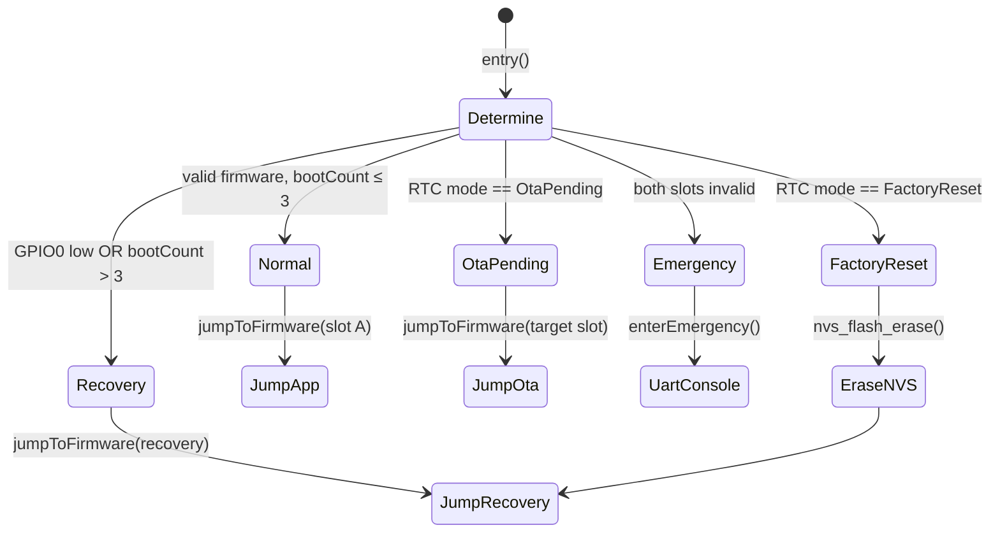
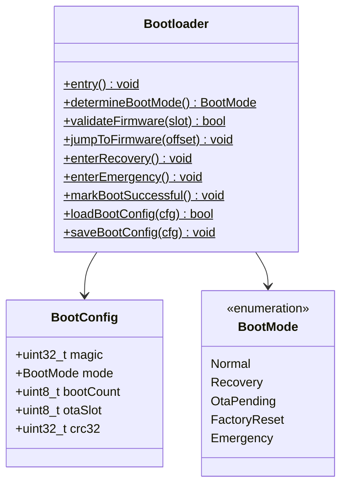

# TAKT OS Bootloader

## Purpose

The bootloader is a minimal firmware image that runs **independently** of the main application. It is launched by the ESP-IDF second-stage bootloader and is responsible for selecting the boot mode, validating firmware, and jumping to the correct partition.

## Functions

| Function | Description |
|----------|-------------|
| System startup | Determine boot mode, jump to firmware |
| Boot mode selection | GPIO, RTC memory, boot counter |
| Validity check | Magic, CRC32, size check of `FirmwareHeader` |
| OTA recovery | Activate new slot after OTA |
| BLE recovery | Jump to recovery partition |
| Emergency recovery | UART console when firmware is fully corrupted |

## Boot modes



## BootConfig (RTC memory)

The structure is stored in `RTC_NOINIT_ATTR` — it survives soft reset but not power cycle:

```cpp
struct BootConfig {
    uint32_t magic;       // 0xB007C0DE
    BootMode mode;        // Normal / Recovery / OtaPending / ...
    uint8_t  bootCount;   // Incremented on every boot
    uint8_t  otaSlot;     // Target OTA slot
    uint32_t crc32;       // Structure CRC
};
```

### bootCount logic

1. On every boot, `bootCount++`
2. If `bootCount > 3` — forced transition to Recovery (boot loop protection)
3. On successful application start, call `Bootloader::markBootSuccessful()` → `bootCount = 0`

## GPIO boot pin

| Pin | State | Action |
|-----|-------|--------|
| GPIO0 | LOW on reset | Recovery mode |
| GPIO0 | HIGH | Normal boot |

## Firmware validation

```
validateFirmware(slot):
  1. Read FirmwareHeader from slot offset
  2. Check magic == 0x54414B54 ('TAKT')
  3. Check flags & VALID
  4. Check size ≤ slot size
  5. Compute CRC32 of image body
  6. Compare with header.crc32
```

## API

```cpp
#include "takt/bootloader.hpp"

// In app_main after successful startup:
takt::boot::Bootloader::markBootSuccessful();

// Force transition to recovery:
BootConfig cfg{};
Bootloader::loadBootConfig(cfg);
cfg.mode = BootMode::Recovery;
Bootloader::saveBootConfig(cfg);
esp_restart();
```

## Independence from main firmware

The bootloader resides in a separate flash partition (`0x001000`, 28 KB). Even when App Slot A and B are fully corrupted:

1. `bootCount` exceeds the threshold → Recovery
2. If Recovery is valid → DFU is available
3. If Recovery is corrupted → Emergency UART console

## UML



---

**TAKT OS** — Developer: **Masyukov Pavel** ([p.masyukov@gmail.com](mailto:p.masyukov@gmail.com)) · License: [Apache License 2.0](https://github.com/TAKT-OS/Takt-OS/blob/main/LICENSE) · [Source](https://github.com/TAKT-OS/Takt-OS)
