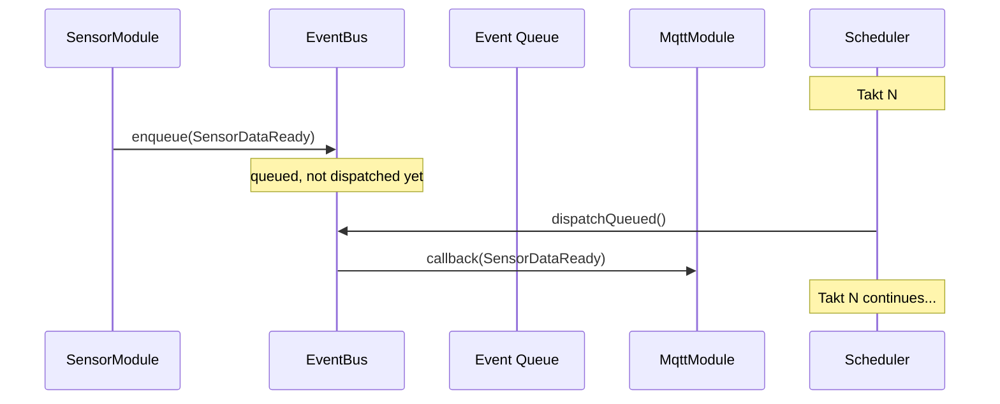
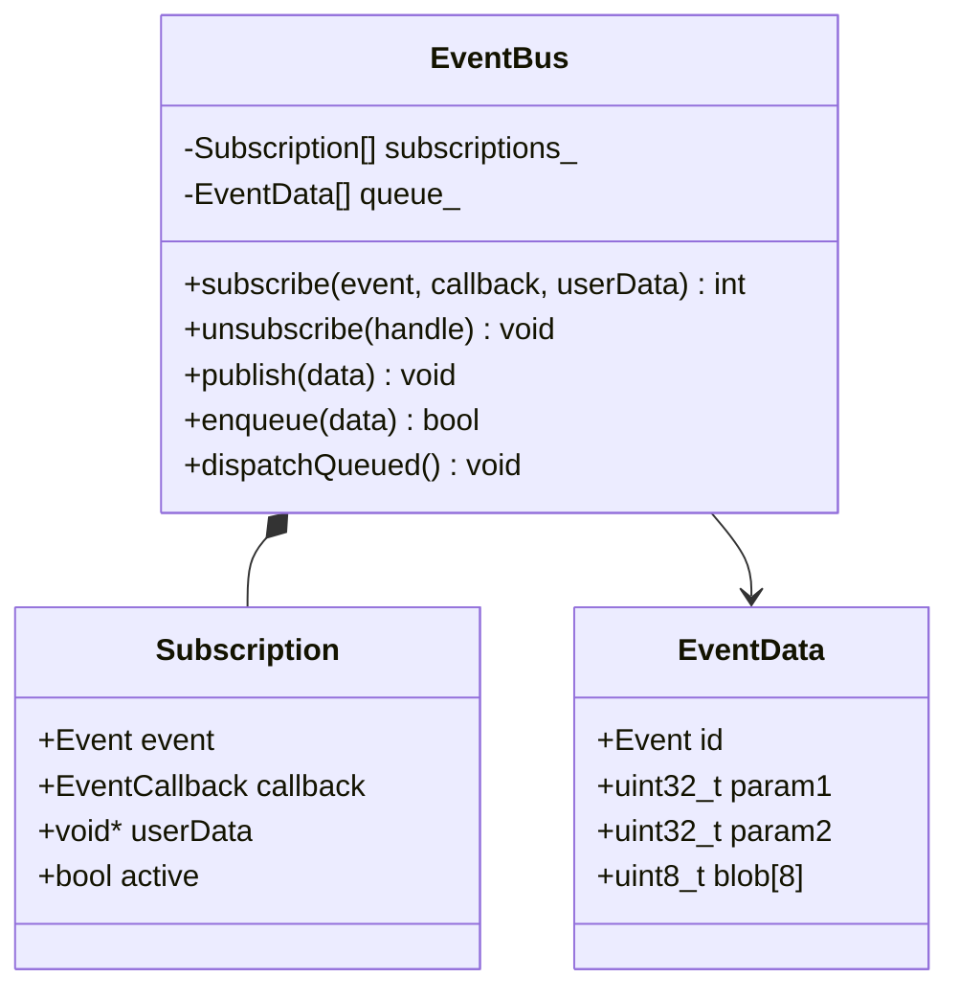

# TAKT OS Event Bus

## Purpose

The event bus is a publish/subscribe event bus for loosely coupled interaction between modules. Modules do not call each other directly; they publish events instead.

## API

### Subscribe

```cpp
// C-style callback
int handle = takt::EventBus::instance().subscribe(
    takt::Event::WiFiConnected,
    [](const takt::EventData& data, void* ctx) {
        auto* mqtt = static_cast<takt::modules::MqttModule*>(ctx);
        mqtt->connect("broker.example.com");
    },
    &mqttModule
);

// Macro
TAKT_SUBSCRIBE(takt::Event::SensorDataReady, onSensorData, nullptr);
```

### Publish

```cpp
// Immediate (synchronous) delivery
takt::EventBus::instance().publish(takt::Event::WiFiConnected);

// With parameters
takt::EventBus::instance().publish(takt::Event::OtaProgress, bytesReceived, totalBytes);

// Deferred (at end of takt)
takt::EventData data{};
data.id = takt::Event::SensorDataReady;
data.param1 = temperature_x100;
takt::EventBus::instance().enqueue(data);
```

### Unsubscribe

```cpp
takt::EventBus::instance().unsubscribe(handle);
```

## Event catalog

| Range | Category | Examples |
|-------|----------|----------|
| 0x0001–0x00FF | System | SystemBoot, TaktOverrun, MemoryLow |
| 0x0100–0x01FF | Connectivity | WiFiConnected, MqttConnected |
| 0x0200–0x02FF | OTA/Recovery | OtaStart, OtaComplete, OtaRollback |
| 0x0300–0x03FF | Application | SensorDataReady, CycleStarted |
| 0x1000+ | User-defined | Application-specific custom events |

## EventData

```cpp
struct EventData {
    Event    id;       // Event identifier
    uint32_t param1;   // First parameter
    uint32_t param2;   // Second parameter
    uint8_t  blob[8];  // Inline payload (up to 8 bytes)
};
```

## Delivery



1. **Synchronous** (`publish`) — immediate invocation of all subscribers
2. **Asynchronous** (`enqueue` + `dispatchQueued`) — delivery at the takt boundary

Recommendation: inside `tick()`, use `enqueue()`, not `publish()` — this prevents cascading callbacks within a single module.

## Limits

| Parameter | Value |
|-----------|-------|
| Max subscribers | 32 |
| Queue depth | 64 |
| Callback type | C function pointer (no heap allocation) |

## UML



---

**TAKT OS** — Developer: **Masyukov Pavel** ([p.masyukov@gmail.com](mailto:p.masyukov@gmail.com)) · License: [Apache License 2.0](https://github.com/TAKT-OS/Takt-OS/blob/main/LICENSE) · [Source](https://github.com/TAKT-OS/Takt-OS)
