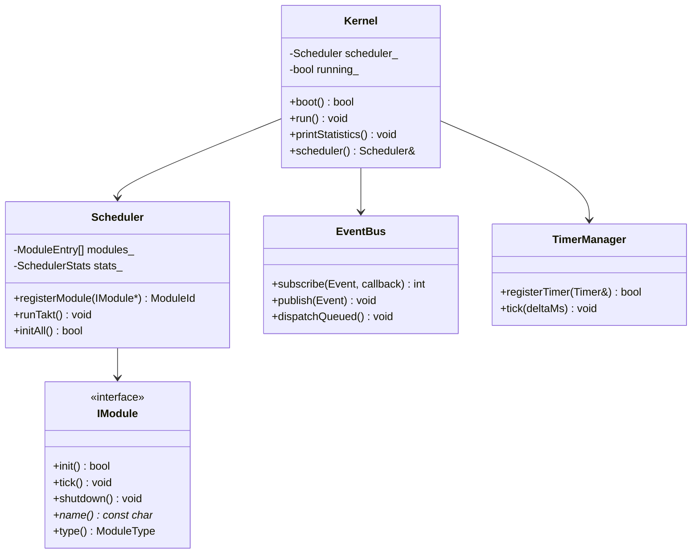

# TAKT OS Kernel

## Overview

The TAKT OS kernel is the central orchestrator of the system. It owns the takt scheduler, event bus, timer manager, and memory subsystems. It does not depend on the ESP-IDF FreeRTOS task API for application logic — all work runs in a single takt loop.

## Kernel components

| Component | File | Purpose |
|-----------|------|---------|
| `Kernel` | `kernel.hpp` | Entry point, lifecycle, diagnostics |
| `Scheduler` | `scheduler.hpp` | Takt loop, module registration |
| `EventBus` | `event_bus.hpp` | Pub/Sub event bus |
| `TimerManager` | `timer_manager.hpp` | Software timers |
| `Logger` | `logger.hpp` | Level-based logging |
| `Diagnostics` | `diagnostics.hpp` | Profiling, heap, stack |
| `StorageManager` | `storage_manager.hpp` | Direct Flash access |
| `CacheManager` | `cache_manager.hpp` | LRU cache over Flash |
| `FirmwareCache` | `firmware_cache.hpp` | Dual-bank OTA |
| `NvsManager` | `nvs_manager.hpp` | Key-value storage |

## Lifecycle

```mermaid
stateDiagram-v2
    [*] --> Boot: Power On
    Boot --> InitNVS: boot()
    InitNVS --> InitModules: NvsManager::init()
    InitModules --> Ready: scheduler.initAll()
    Ready --> Running: run()
    Running --> Running: runTakt()
    Running --> Shutdown: requestShutdown()
    Shutdown --> [*]: shutdownAll()
```

## API

### Initialization

```cpp
auto& kernel = takt::Kernel::instance();
auto& scheduler = kernel.scheduler();

scheduler.registerModule(&uartModule);
scheduler.registerModule(&sensorModule);

scheduler.setTaktPeriodMs(1);      // 1 ms between takts
scheduler.setTaktBudgetUs(5000);   // 5 ms maximum per takt

kernel.boot();  // init NVS, init modules, publish SystemReady
kernel.run();   // infinite takt loop
```

### Diagnostics

```cpp
kernel.printStatistics();
// Output:
// === TAKT OS Statistics ===
// Uptime: 30000 ms
// Takts: 30000, max: 1200 us, overruns: 0
// Heap free: 180000, min: 175000, largest block: 110000
// Modules: 6
//   [0] ticks=30000 last=45 us max=120 us overruns=0 skips=0
//   ...
```

## Execution model

The kernel runs in the context of ESP-IDF `app_main()` (or host `main()`). Between takts on ESP32, `vTaskDelay()` yields the CPU to the IDLE task — this is the only interaction point with FreeRTOS.

```
app_main()
  └─ Kernel::boot()
       ├─ NvsManager::init()
       ├─ EventBus::publish(SystemBoot)
       └─ Scheduler::initAll()
            └─ IModule::init() × N
  └─ Kernel::run()
       └─ Scheduler::run()
            └─ loop:
                 ├─ TimerManager::tick(deltaMs)
                 ├─ EventBus::dispatchQueued()
                 ├─ IModule::tick() × N  (sequential)
                 └─ overrun detection
```

## Configuration

| Parameter | Default | Description |
|-----------|---------|-------------|
| `kMaxModules` | 48 | Max registered modules |
| `kMaxTimers` | 32 | Max active timers |
| `kMaxEventSubscribers` | 32 | Max EventBus subscribers |
| `kEventQueueDepth` | 64 | Deferred event queue depth |
| `TAKT_LOG_LEVEL` | Debug | Logging level |

## UML class diagram



---

**TAKT OS** — Developer: **Masyukov Pavel** ([p.masyukov@gmail.com](mailto:p.masyukov@gmail.com)) · License: [Apache License 2.0](https://github.com/TAKT-OS/Takt-OS/blob/main/LICENSE) · [Source](https://github.com/TAKT-OS/Takt-OS)
