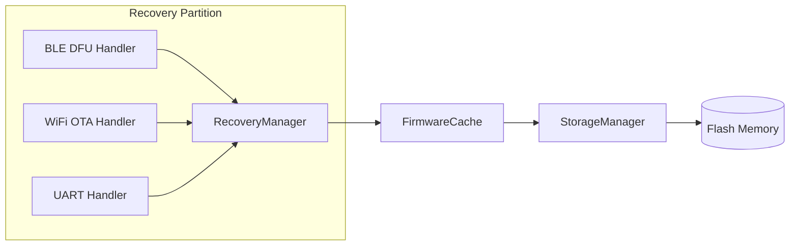
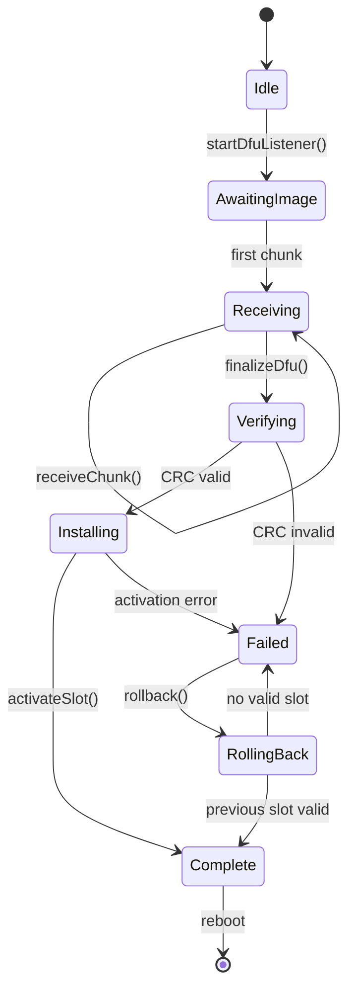

# TAKT OS Recovery Layer

## Purpose

Recovery is an autonomous recovery module located in a separate flash partition (256 KB at `0x110000`). It is started by the bootloader when the main firmware is invalid or on user request. It provides firmware update and rollback even when the application layer is fully corrupted.

## Functions

| Function | Channel | Description |
|----------|---------|-------------|
| BLE DFU | Bluetooth LE | Receive firmware over GATT |
| OTA DFU | WiFi | HTTP/MQTT firmware download |
| Firmware upload | UART | Manufacturing fallback |
| Rollback | Internal | Activate previous slot |

## Architecture



## DFU state machine



## API

```cpp
#include "takt/recovery_manager.hpp"

auto& recovery = takt::recovery::RecoveryManager::instance();

recovery.init(takt::recovery::RecoveryChannel::Ble);
recovery.onProgress([](uint32_t rx, uint32_t total, auto state) {
    printf("DFU: %u/%u state=%u\n", rx, total, static_cast<uint8_t>(state));
});

recovery.startDfuListener();
// ... chunks arrive via BLE/WiFi/UART ...
recovery.finalizeDfu();  // verify + install + reboot
```

## Firmware rollback

Dual-bank architecture (Slot A / Slot B):

1. Active slot — current firmware
2. Inactive slot — receives OTA image
3. After successful write and verification — `activateSlot(inactive)`
4. On failure of new firmware (`bootCount > 3`) — bootloader starts Recovery
5. `rollback()` — atomic activation of the previous slot

```cpp
// Rollback from application:
takt::recovery::RecoveryManager::instance().rollback();
// or via OTA Service:
takt::services::OtaService::rollback();
```

## Independence

Recovery partition:

- Own `CMakeLists.txt` / ESP-IDF component
- Minimal dependencies: `takt_kernel` (StorageManager, FirmwareCache, Logger)
- Does not depend on middleware (WiFi, MQTT, BLE modules)
- BLE/WiFi stacks are initialized inside recovery when needed

## Security

- CRC32 verification before activation
- Writes only to the inactive slot
- Atomic slot switch (update flags in `FirmwareHeader`)
- `bootCount` watchdog prevents boot loop on corrupted firmware

---

**TAKT OS** — Developer: **Masyukov Pavel** ([p.masyukov@gmail.com](mailto:p.masyukov@gmail.com)) · License: [Apache License 2.0](https://github.com/TAKT-OS/Takt-OS/blob/main/LICENSE) · [Source](https://github.com/TAKT-OS/Takt-OS)
