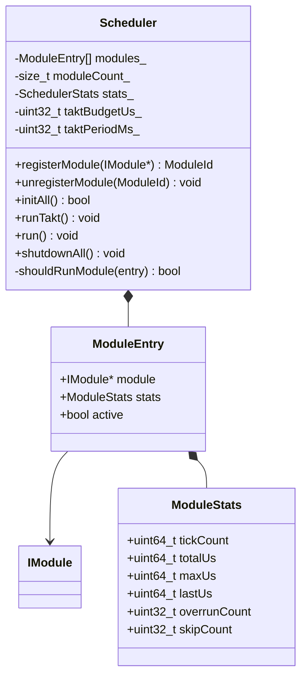

# TAKT OS Scheduler

## Concept

The scheduler is the heart of TAKT OS. Each call to `runTakt()` is one takt: a sequential pass over all registered modules with timing measurement and overrun detection.

## Takt algorithm

```
runTakt():
  1. taktStart = nowUs()
  2. TimerManager::tick(taktPeriodMs)
  3. EventBus::dispatchQueued()
  4. for each registered module (in order):
       a. if !shouldRunModule(): skip, increment skipCount
       b. modStart = nowUs()
       c. module->tick()
       d. modElapsed = nowUs() - modStart
       e. update ModuleStats (tickCount, lastUs, maxUs, totalUs)
       f. if modElapsed > budgetUs(): increment overrunCount, log warning
  5. taktElapsed = nowUs() - taktStart
  6. update SchedulerStats
  7. if taktElapsed > taktBudgetUs: publish TaktOverrun event
```

## Dispatch policy

| ModuleType | Invocation condition | When idle |
|------------|----------------------|-----------|
| `Static` | Always | `tick()` is called |
| `Dynamic` | Always | `tick()` is called |
| `Background` | `hasWork() == true` | Skipped, `skipCount++` |

## Module registration

```cpp
takt::Scheduler scheduler;

takt::modules::UartModule   uart(0, 16);
takt::modules::SensorModule sensor;
takt::modules::WiFiModule   wifi;

auto uartId = scheduler.registerModule(&uart);    // ModuleId = 0
auto sensId = scheduler.registerModule(&sensor);  // ModuleId = 1
auto wifiId = scheduler.registerModule(&wifi);    // ModuleId = 2

scheduler.initAll();  // call init() for each module
```

Registration order equals invocation order within a takt. For industrial systems, the recommended order is:

1. Time-critical modules (Sensor, GPIO) — first
2. Communication (UART, Modbus) — middle
3. Network (WiFi, MQTT, BLE) — near the end
4. Background (OTA, File) — last

## Statistics

### SchedulerStats

| Field | Type | Description |
|-------|------|-------------|
| `totalTakts` | uint64 | Total number of takts |
| `totalTaktUs` | uint64 | Cumulative time of all takts |
| `maxTaktUs` | uint64 | Maximum takt duration |
| `lastTaktUs` | uint64 | Duration of the last takt |
| `overrunCount` | uint32 | Number of `taktBudgetUs` violations |
| `registeredModules` | uint32 | Number of modules |

### ModuleStats

| Field | Type | Description |
|-------|------|-------------|
| `tickCount` | uint64 | How many times `tick()` was called |
| `totalUs` | uint64 | Cumulative time |
| `maxUs` | uint64 | Maximum single `tick()` duration |
| `lastUs` | uint64 | Duration of the last `tick()` |
| `overrunCount` | uint32 | `budgetUs()` violations |
| `skipCount` | uint32 | Skips (background idle) |

## Budget configuration

```cpp
scheduler.setTaktPeriodMs(1);       // Takt period: 1 ms
scheduler.setTaktBudgetUs(5000);    // Budget: 5 ms (for demo controller)

// Per-module budget (static modules):
class UartModule : public IModule {
    uint32_t budgetUs() const override { return 500; }  // 500 µs
};
```

## UML



## Recommendations

1. **1 ms takt period** — optimal for the demo controller and IoT gateways
2. **`taktBudgetUs` ≤ 80% of the period** — leave headroom for the FreeRTOS IDLE task
3. **Static modules** — always set `budgetUs()`
4. **Dynamic modules** — bound work inside `tick()`, do not block
5. **Background modules** — implement `hasWork()` correctly

---

**TAKT OS** — Developer: **Masyukov Pavel** ([p.masyukov@gmail.com](mailto:p.masyukov@gmail.com)) · License: [Apache License 2.0](https://github.com/TAKT-OS/Takt-OS/blob/main/LICENSE) · [Source](https://github.com/TAKT-OS/Takt-OS)
