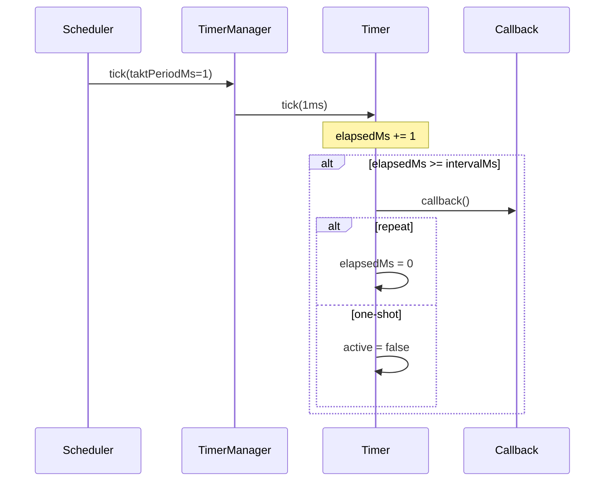
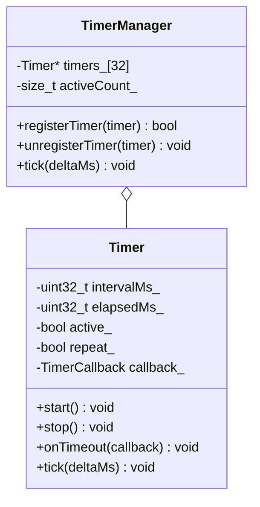

# TAKT OS Timer Manager

## Purpose

TimerManager provides software timers tied to the takt loop. Timer resolution equals the takt period (`taktPeriodMs`).

## API

```cpp
// One-shot timer: fire once after 1000 ms
takt::Timer heartbeat(1000, false);
heartbeat.onTimeout([]() {
    takt::TAKT_LOGI("App", "Heartbeat");
});
heartbeat.start();

// Repeating timer: every 5 seconds
takt::Timer telemetry(5000, true);
telemetry.onTimeout([&mqtt]() {
    mqtt.publish("telemetry/temp", "25.5");
});
telemetry.start();

// Control
telemetry.stop();
telemetry.reset();          // reset elapsed, keep active
telemetry.setInterval(10000);
```

## How it works



1. `Scheduler::runTakt()` calls `TimerManager::tick(taktPeriodMs_)`
2. TimerManager advances all active timers by `deltaMs`
3. When `elapsedMs >= intervalMs`, the callback runs
4. One-shot: timer is deactivated; repeat: `elapsedMs` is reset

## Registration

A timer is registered automatically when `onTimeout()` is called:

```cpp
void Timer::onTimeout(TimerCallback callback) {
    callback_ = std::move(callback);
    TimerManager::instance().registerTimer(*this);
}
```

On destruction (`~Timer()`), the timer is unregistered automatically.

## Limits

| Parameter | Value |
|-----------|-------|
| Max timers | 32 |
| Min resolution | = taktPeriodMs (default 1 ms) |
| Callback | `std::function<void()>` |
| Thread safety | Single-threaded (takt loop) |

## Usage examples

### Watchdog feed

```cpp
takt::Timer wdtTimer(3000, true);
wdtTimer.onTimeout([]() {
    takt::drivers::Platform::feedWatchdog();
});
wdtTimer.start();
```

### Periodic statistics

```cpp
takt::Timer statsTimer(30000, true);
statsTimer.onTimeout([&kernel]() {
    kernel.printStatistics();
});
statsTimer.start();
```

### Reconnect backoff

```cpp
// In WiFiModule:
reconnectTimer_.setInterval(5000);
reconnectTimer_.setRepeat(true);
reconnectTimer_.onTimeout([this]() {
    if (!connected_) reconnectPending_ = true;
});
reconnectTimer_.start();
```

## UML



---

**TAKT OS** — Developer: **Masyukov Pavel** ([p.masyukov@gmail.com](mailto:p.masyukov@gmail.com)) · License: [Apache License 2.0](https://github.com/TAKT-OS/Takt-OS/blob/main/LICENSE) · [Source](https://github.com/TAKT-OS/Takt-OS)
