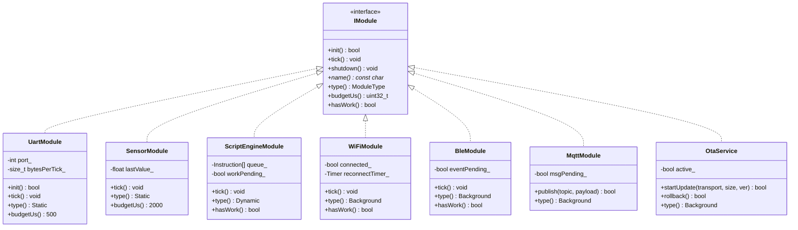
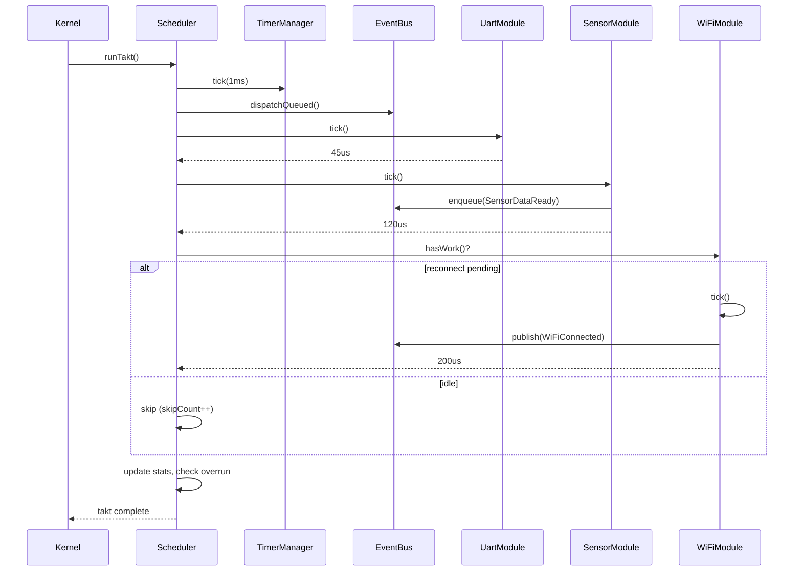
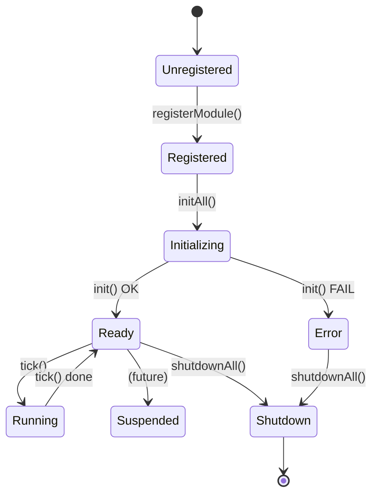
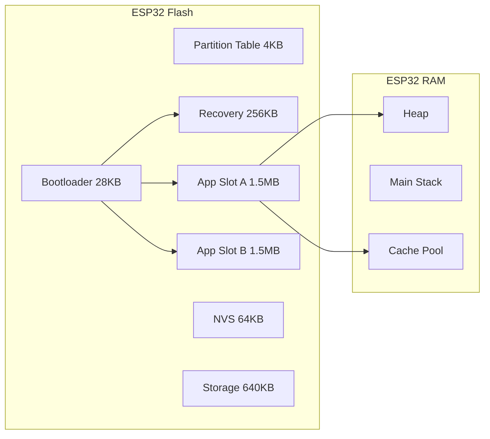

# TAKT OS — UML Component Diagram

```mermaid
graph TB
    subgraph "Application Layer"
        DemoApp[Demo Controller]
        Gateway[IoT Gateway]
        Telemetry[Telemetry Node]
    end

    subgraph "Middleware"
        UART[UartModule]
        Sensor[SensorModule]
        Script[ScriptEngineModule]
        WiFi[WiFiModule]
        MQTT[MqttModule]
        BLE[BleModule]
    end

    subgraph "Services"
        OTA[OtaService]
    end

    subgraph "Kernel"
        Kernel[Kernel]
        Scheduler[Scheduler]
        EventBus[EventBus]
        TimerMgr[TimerManager]
        Logger[Logger]
        Diag[Diagnostics]
        Storage[StorageManager]
        Cache[CacheManager]
        FwCache[FirmwareCache]
        NVS[NvsManager]
    end

    subgraph "Recovery"
        Recovery[RecoveryManager]
    end

    subgraph "Bootloader"
        Boot[Bootloader]
    end

    subgraph "Drivers"
        Platform[Platform]
        GPIO[GPIO]
        HW_UART[HW UART]
        ADC[ADC]
    end

    DemoApp --> UART
    DemoApp --> Sensor
    DemoApp --> WiFi
    DemoApp --> MQTT
    DemoApp --> OTA

    UART --> Scheduler
    Sensor --> Scheduler
    WiFi --> Scheduler
    MQTT --> Scheduler
    BLE --> Scheduler
    OTA --> Scheduler

    Kernel --> Scheduler
    Kernel --> EventBus
    Kernel --> TimerMgr
    Kernel --> Diag

    Scheduler --> EventBus
    Scheduler --> TimerMgr

    OTA --> FwCache
    Recovery --> FwCache
    FwCache --> Storage
    Cache --> Storage

    Boot --> Recovery
    Boot --> FwCache

    UART --> HW_UART
    Sensor --> ADC
    WiFi --> Platform
    Platform --> GPIO
```

# TAKT OS — UML Class Diagram (Modules)



# TAKT OS — UML Sequence: Full Takt Cycle



# TAKT OS — UML State: Module Lifecycle



# TAKT OS — UML Deployment



---

**TAKT OS** — Developer: **Masyukov Pavel** ([p.masyukov@gmail.com](mailto:p.masyukov@gmail.com)) · License: [Apache License 2.0](https://github.com/TAKT-OS/Takt-OS/blob/main/LICENSE) · [Source](https://github.com/TAKT-OS/Takt-OS)
